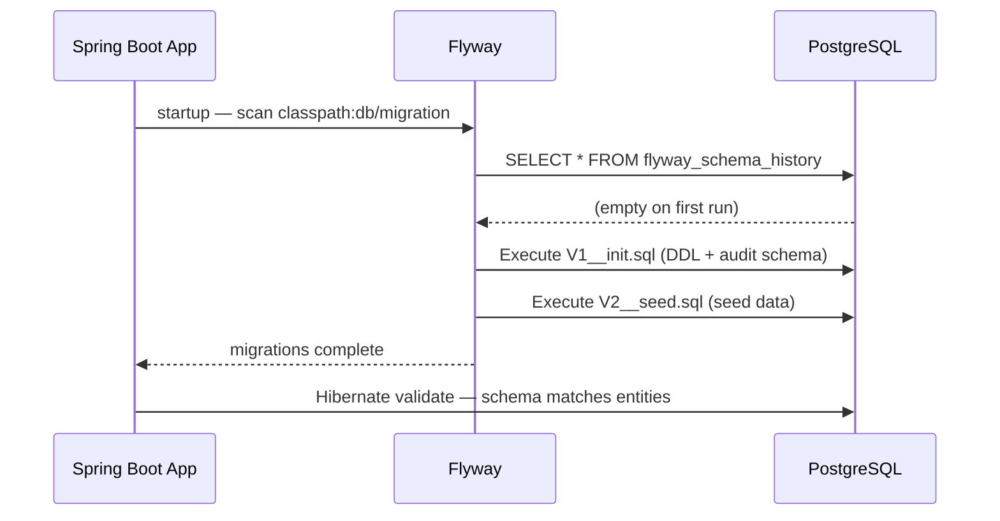
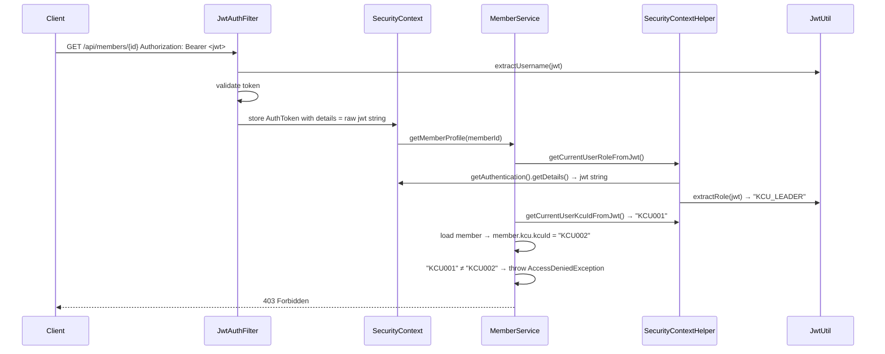
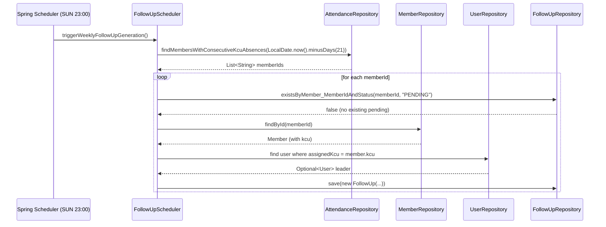
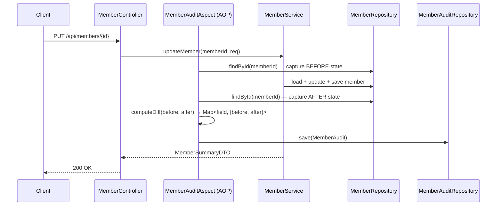

# Design Document: CMS Backend Alignment

## Overview

This document covers four targeted backend changes to align the Church Management System (CMS) Spring Boot 4.x application with the SDS/SRS specification. The changes are: (1) replacing ad-hoc Hibernate DDL with Flyway versioned migrations, (2) adding server-side KCU scope guards to prevent cross-KCU data access, (3) introducing a Sunday-night scheduler that auto-generates follow-ups for members with consecutive KCU absences, and (4) adding an AOP-based audit trail that records field-level diffs whenever a member profile is updated.

The stack is Spring Boot 4.0.6, Java 21, PostgreSQL, Lombok, JJWT 0.12.6, Spring Security, and Spring Data JPA. Two new Maven dependencies are required: `org.flywaydb:flyway-core` and `spring-boot-starter-aop`. Two new packages are introduced: `com.church.cms.scheduler` and `com.church.cms.aspect`.

## Architecture

```mermaid
graph TD
    subgraph "Change 1 — Flyway"
        S[schema.sql] -->|migrated to| V1[V1__init.sql]
        I[import.sql] -->|migrated to| V2[V2__seed.sql]
        V1 --> FW[Flyway Engine]
        V2 --> FW
        FW --> DB[(PostgreSQL)]
    end

    subgraph "Change 2 — KCU Scoping"
        REQ[HTTP Request] --> JAF[JwtAuthFilter]
        JAF -->|stores raw JWT in details| SC[SecurityContext]
        SC --> SCH[SecurityContextHelper]
        SCH -->|extractKcuId / extractRole from JWT| JU[JwtUtil]
        SCH --> MS[MemberService.getMemberProfile]
        SCH --> AS[AttendanceService.submitBulkAttendance]
    end

    subgraph "Change 3 — Scheduler"
        CRON["@Scheduled(cron SUN 23:00)"] --> FUS[FollowUpScheduler]
        FUS --> AR[AttendanceRepository.findMembersWithConsecutiveKcuAbsences]
        FUS --> FUR[FollowUpRepository.existsByMember_MemberIdAndStatus]
        FUS --> FUR2[FollowUpRepository.save]
    end

    subgraph "Change 4 — AOP Audit"
        MC[MemberController] --> MS2[MemberService.updateMember]
        MS2 -->|intercepted by| MAA[MemberAuditAspect]
        MAA -->|before state| MR[MemberRepository.findById]
        MAA -->|after state + diff| MAR[MemberAuditRepository.save]
        MAR --> ADB[(audit_log.member_audit)]
    end
```



## Change 1 — Flyway Migration Strategy

### Motivation

The current setup uses `spring.jpa.hibernate.ddl-auto=update` with a hand-maintained `schema.sql` and `import.sql`. This is unsafe for production: Hibernate's `update` mode cannot drop columns, rename constraints, or guarantee idempotent execution. Flyway provides versioned, checksummed, ordered migrations that run exactly once.

### Sequence Diagram



### Files to Create / Modify

| Action | File |
|--------|------|
| DELETE | `src/main/resources/schema.sql` |
| DELETE | `src/main/resources/import.sql` |
| CREATE | `src/main/resources/db/migration/V1__init.sql` |
| CREATE | `src/main/resources/db/migration/V2__seed.sql` |
| MODIFY | `pom.xml` — add `flyway-core` dependency |
| MODIFY | `application.properties` — switch ddl-auto, enable Flyway |

### V1__init.sql Content

V1 contains the full DDL from the existing `schema.sql` plus the `audit_log` schema and table. All `CREATE TABLE` and `CREATE INDEX` statements already use `IF NOT EXISTS`. The deferred FK for `follow_ups.assigned_to_user_id → users` is included via the existing `DO $$ ... $$` block.

Additional DDL appended at the end of V1:

```sql
CREATE SCHEMA IF NOT EXISTS audit_log;

CREATE TABLE IF NOT EXISTS audit_log.member_audit (
    audit_id    BIGSERIAL    PRIMARY KEY,
    member_id   VARCHAR(50)  NOT NULL,
    changed_by  VARCHAR(100) NOT NULL,
    changed_at  TIMESTAMP    NOT NULL DEFAULT NOW(),
    operation   VARCHAR(20)  NOT NULL,  -- 'UPDATE'
    diff_json   JSONB        NOT NULL
);

CREATE INDEX IF NOT EXISTS idx_member_audit_member ON audit_log.member_audit(member_id);
CREATE INDEX IF NOT EXISTS idx_member_audit_time   ON audit_log.member_audit(changed_at);
```

### V2__seed.sql Content

V2 is a verbatim copy of `import.sql`. All inserts already use `ON CONFLICT DO NOTHING`, making them idempotent. The `UPDATE members SET partner_member_id = 'M012' ...` statement is retained as-is.

### application.properties Changes

```properties
# Remove:
spring.jpa.hibernate.ddl-auto=update
spring.sql.init.mode=never

# Add / replace:
spring.jpa.hibernate.ddl-auto=validate
spring.flyway.enabled=true
spring.flyway.locations=classpath:db/migration
```

### pom.xml Change

```xml
<dependency>
    <groupId>org.flywaydb</groupId>
    <artifactId>flyway-core</artifactId>
    <!-- version managed by Spring Boot BOM -->
</dependency>
<dependency>
    <groupId>org.flywaydb</groupId>
    <artifactId>flyway-database-postgresql</artifactId>
    <!-- required for Spring Boot 4.x / Flyway 10.x PostgreSQL support -->
</dependency>
```

> **Note:** Spring Boot 4.x uses Flyway 10.x which requires the separate `flyway-database-postgresql` artifact in addition to `flyway-core`.

## Change 2 — Server-side KCU Scoping

### Motivation

`SecurityContextHelper.getCurrentUser()` hits the `users` table on every call. More critically, `MemberService.getMemberProfile()` and `AttendanceService.submitBulkAttendance()` have no KCU scope guard — a `KCU_LEADER` can fetch any member's profile or submit attendance for members outside their KCU. The fix reads `kcuId` and `role` directly from JWT claims (already embedded at login by `AuthService`), eliminating the DB roundtrip and adding the missing access checks.

### Sequence Diagram — getMemberProfile with KCU Guard



### Components to Modify

#### JwtUtil — new methods

```java
public String extractKcuId(String token) {
    return extractClaim(token, claims -> claims.get("kcuId", String.class));
}

public String extractRole(String token) {
    return extractClaim(token, claims -> claims.get("role", String.class));
}
```

#### JwtAuthFilter — store raw JWT in details

Replace:
```java
authToken.setDetails(new WebAuthenticationDetailsSource().buildDetails(request));
```
With:
```java
authToken.setDetails(jwt);  // store raw JWT string for downstream claim extraction
```

#### SecurityContextHelper — new JWT-direct methods

```java
private String getRawJwt() {
    Authentication auth = SecurityContextHolder.getContext().getAuthentication();
    Object details = auth.getDetails();
    if (details instanceof String jwt) return jwt;
    throw new RuntimeException("JWT not available in SecurityContext details");
}

public String getCurrentUserKcuIdFromJwt() {
    return jwtUtil.extractKcuId(getRawJwt());
}

public String getCurrentUserRoleFromJwt() {
    return jwtUtil.extractRole(getRawJwt());
}
```

`SecurityContextHelper` must gain a `JwtUtil` dependency (constructor injection via Lombok `@RequiredArgsConstructor`).

#### MemberService.getMemberProfile — add KCU scope guard

After loading the member, before building the DTO:

```java
String role = securityContextHelper.getCurrentUserRoleFromJwt();
if ("KCU_LEADER".equals(role)) {
    String leaderKcuId = securityContextHelper.getCurrentUserKcuIdFromJwt();
    if (m.getKcu() == null || !m.getKcu().getKcuId().equals(leaderKcuId)) {
        throw new AccessDeniedException("Access denied: member not in your KCU");
    }
}
```

Import: `org.springframework.security.access.AccessDeniedException`

#### AttendanceService.submitBulkAttendance — add KCU scope guard

Before the save loop:

```java
String role = securityContextHelper.getCurrentUserRoleFromJwt();
String leaderKcuId = "KCU_LEADER".equals(role)
    ? securityContextHelper.getCurrentUserKcuIdFromJwt() : null;

for (AttendanceSubmissionDTO dto : submissions) {
    Member member = memberRepository.findById(dto.memberId())
        .orElseThrow(() -> new RuntimeException("Member not found: " + dto.memberId()));

    if (leaderKcuId != null) {
        if (member.getKcu() == null || !member.getKcu().getKcuId().equals(leaderKcuId)) {
            throw new AccessDeniedException(
                "Access denied: member " + dto.memberId() + " is not in your KCU");
        }
    }
    // ... save attendance
}
```

The entire batch is rejected atomically because the method is `@Transactional`.

#### MemberService — update resolveKcuScope and resolveZoneScope

The existing `resolveKcuScope` and `resolveZoneScope` helpers call `securityContextHelper.getCurrentUserRole()` (DB roundtrip). Update them to use `getCurrentUserRoleFromJwt()` and `getCurrentUserKcuIdFromJwt()` / `getCurrentUserZoneId()` (the zone ID still comes from DB since it is not in the JWT claims — or add it; the JWT already embeds `zoneId` so use `getCurrentUserZoneIdFromJwt()` as well).

Add to `SecurityContextHelper`:
```java
public String getCurrentUserZoneIdFromJwt() {
    return jwtUtil.extractClaim(getRawJwt(),
        claims -> claims.get("zoneId", String.class));
}
```

## Change 3 — Sunday 11 PM Follow-Up Scheduler

### Motivation

The existing `AttendanceService.triggerCareEngine()` fires on every bulk attendance submission and looks at any two absences across both `SUNDAY` and `KCU` event types. The SRS requires a dedicated weekly scheduler that specifically targets **KCU absences** over a **3-week (21-day) window** and creates follow-ups only for members with **2+ consecutive KCU absences**.

### Sequence Diagram



### New Class: FollowUpScheduler

Package: `com.church.cms.scheduler`

```java
@Component
@RequiredArgsConstructor
@Transactional
public class FollowUpScheduler {

    private final AttendanceRepository attendanceRepository;
    private final MemberRepository memberRepository;
    private final FollowUpRepository followUpRepository;
    private final UserRepository userRepository;

    @Scheduled(cron = "0 0 23 * * SUN")
    public void triggerWeeklyFollowUpGeneration() {
        LocalDate since = LocalDate.now().minusDays(21);
        List<String> memberIds =
            attendanceRepository.findMembersWithConsecutiveKcuAbsences(since);

        for (String memberId : memberIds) {
            if (followUpRepository.existsByMember_MemberIdAndStatus(memberId, "PENDING")) {
                continue;
            }
            Member member = memberRepository.findById(memberId).orElse(null);
            if (member == null) continue;

            FollowUp followUp = new FollowUp();
            followUp.setFollowupId(UUID.randomUUID().toString());
            followUp.setMember(member);
            followUp.setReason("Missed 2+ KCU Sessions (3-week window)");
            followUp.setStatus("PENDING");
            followUp.setCreatedAt(LocalDateTime.now());

            if (member.getKcu() != null) {
                userRepository.findAll().stream()
                    .filter(u -> u.getAssignedKcu() != null
                        && u.getAssignedKcu().getKcuId().equals(member.getKcu().getKcuId()))
                    .findFirst()
                    .ifPresent(followUp::setAssignedTo);
            }
            followUpRepository.save(followUp);
        }
    }
}
```

### New JPQL Query: AttendanceRepository

```java
@Query("""
    SELECT a.member.memberId
    FROM Attendance a
    WHERE a.status = 'ABSENT'
      AND a.eventType = 'KCU'
      AND a.attDate >= :since
    GROUP BY a.member.memberId
    HAVING COUNT(a) >= 2
    """)
List<String> findMembersWithConsecutiveKcuAbsences(@Param("since") LocalDate since);
```

### CmsApplication — enable scheduling

```java
@SpringBootApplication
@EnableScheduling
public class CmsApplication { ... }
```

## Change 4 — AOP Audit Trail Aspect

### Motivation

The SRS requires a field-level audit trail for member profile updates. Spring AOP provides a clean, non-invasive way to intercept `MemberService.updateMember()`, capture before/after state, compute a diff, and persist it to the `audit_log.member_audit` table without polluting the service layer.

### Sequence Diagram



### New Dependency: pom.xml

```xml
<dependency>
    <groupId>org.springframework.boot</groupId>
    <artifactId>spring-boot-starter-aop</artifactId>
</dependency>
```

### New Entity: MemberAudit

Package: `com.church.cms.entity`

```java
@Entity
@Table(schema = "audit_log", name = "member_audit")
@Getter @Setter @NoArgsConstructor @AllArgsConstructor
public class MemberAudit {

    @Id
    @GeneratedValue(strategy = GenerationType.IDENTITY)
    @Column(name = "audit_id")
    private Long auditId;

    @Column(name = "member_id", nullable = false, length = 50)
    private String memberId;

    @Column(name = "changed_by", nullable = false, length = 100)
    private String changedBy;

    @Column(name = "changed_at", nullable = false)
    private LocalDateTime changedAt;

    @Column(name = "operation", nullable = false, length = 20)
    private String operation;  // always "UPDATE"

    @Column(name = "diff_json", nullable = false, columnDefinition = "jsonb")
    private String diffJson;   // Jackson-serialized Map<String, Map<String,Object>>
}
```

### New Repository: MemberAuditRepository

Package: `com.church.cms.repository`

```java
@Repository
public interface MemberAuditRepository extends JpaRepository<MemberAudit, Long> {
    List<MemberAudit> findByMemberIdOrderByChangedAtDesc(String memberId);
}
```

### New Method: MemberService.updateMember

```java
@Transactional
public MemberSummaryDTO updateMember(String memberId, MemberRegistrationRequest req) {
    Member member = memberRepository.findById(memberId)
        .orElseThrow(() -> new RuntimeException("Member not found: " + memberId));

    // Update all mutable fields from req
    if (req.fullName()       != null) member.setFullName(req.fullName());
    if (req.phone()          != null) member.setPhone(req.phone());
    if (req.gender()         != null) member.setGender(req.gender());
    if (req.birthDate()      != null) member.setBirthDate(req.birthDate());
    if (req.maritalStatus()  != null) member.setMaritalStatus(req.maritalStatus());
    if (req.salvationStatus()!= null) member.setSalvationStatus(req.salvationStatus());
    if (req.salvationDate()  != null) member.setSalvationDate(req.salvationDate());
    if (req.baptismStatus()  != null) member.setBaptismStatus(req.baptismStatus());
    if (req.rightHandGiven() != null) member.setRightHandGiven(req.rightHandGiven());
    if (req.vipStatus()      != null) member.setVipStatus(req.vipStatus());
    if (req.notes()          != null) member.setNotes(req.notes());
    if (req.zoneId()         != null) {
        member.setZone(zoneRepository.findById(req.zoneId())
            .orElseThrow(() -> new RuntimeException("Zone not found: " + req.zoneId())));
    }
    if (req.kcuId()          != null) {
        member.setKcu(kcuRepository.findById(req.kcuId())
            .orElseThrow(() -> new RuntimeException("KCU not found: " + req.kcuId())));
    }
    memberRepository.save(member);
    return toSummaryDTO(member);
}
```

### New Aspect: MemberAuditAspect

Package: `com.church.cms.aspect`

```java
@Aspect
@Component
@RequiredArgsConstructor
public class MemberAuditAspect {

    private final MemberRepository memberRepository;
    private final MemberAuditRepository memberAuditRepository;
    private final SecurityContextHelper securityContextHelper;
    private final ObjectMapper objectMapper;

    @Around("execution(* com.church.cms.service.MemberService.updateMember(String, ..))")
    public Object auditMemberUpdate(ProceedingJoinPoint pjp) throws Throwable {
        String memberId = (String) pjp.getArgs()[0];

        // Capture BEFORE state
        Member before = memberRepository.findById(memberId).orElse(null);
        Map<String, Object> beforeMap = before != null ? toFieldMap(before) : Map.of();

        // Proceed with the actual update
        Object result = pjp.proceed();

        // Capture AFTER state
        Member after = memberRepository.findById(memberId).orElse(null);
        Map<String, Object> afterMap = after != null ? toFieldMap(after) : Map.of();

        // Compute diff
        Map<String, Map<String, Object>> diff = computeDiff(beforeMap, afterMap);
        if (!diff.isEmpty()) {
            MemberAudit audit = new MemberAudit();
            audit.setMemberId(memberId);
            audit.setChangedBy(securityContextHelper.getCurrentUser().getUsername());
            audit.setChangedAt(LocalDateTime.now());
            audit.setOperation("UPDATE");
            audit.setDiffJson(objectMapper.writeValueAsString(diff));
            memberAuditRepository.save(audit);
        }
        return result;
    }

    private Map<String, Object> toFieldMap(Member m) {
        Map<String, Object> map = new LinkedHashMap<>();
        map.put("fullName",       m.getFullName());
        map.put("phone",          m.getPhone());
        map.put("gender",         m.getGender());
        map.put("birthDate",      m.getBirthDate());
        map.put("maritalStatus",  m.getMaritalStatus());
        map.put("salvationStatus",m.getSalvationStatus());
        map.put("salvationDate",  m.getSalvationDate());
        map.put("baptismStatus",  m.getBaptismStatus());
        map.put("rightHandGiven", m.getRightHandGiven());
        map.put("vipStatus",      m.getVipStatus());
        map.put("memberStatus",   m.getMemberStatus());
        map.put("notes",          m.getNotes());
        map.put("zoneId",         m.getZone()  != null ? m.getZone().getZoneId()  : null);
        map.put("kcuId",          m.getKcu()   != null ? m.getKcu().getKcuId()    : null);
        return map;
    }

    private Map<String, Map<String, Object>> computeDiff(
            Map<String, Object> before, Map<String, Object> after) {
        Map<String, Map<String, Object>> diff = new LinkedHashMap<>();
        for (String key : after.keySet()) {
            Object bVal = before.get(key);
            Object aVal = after.get(key);
            if (!Objects.equals(bVal, aVal)) {
                diff.put(key, Map.of("before", bVal != null ? bVal : "null",
                                     "after",  aVal != null ? aVal : "null"));
            }
        }
        return diff;
    }
}
```

### MemberController — new PUT endpoint

```java
@PutMapping("/{memberId}")
public ResponseEntity<MemberSummaryDTO> updateMember(
        @PathVariable String memberId,
        @RequestBody @Valid MemberRegistrationRequest req) {
    return ResponseEntity.ok(memberService.updateMember(memberId, req));
}
```

## Components and Interfaces

### JwtUtil (modified)

**Purpose**: Parse and generate JWT tokens; expose claim extractors for `kcuId` and `role`.

**New interface additions**:
```java
public String extractKcuId(String token);   // reads "kcuId" claim
public String extractRole(String token);    // reads "role" claim
```

### JwtAuthFilter (modified)

**Purpose**: Validate Bearer tokens and populate the `SecurityContext`; store the raw JWT string in `Authentication.details` for downstream claim extraction.

### SecurityContextHelper (modified)

**Purpose**: Provide the current user's identity and scope to service-layer code. New JWT-direct methods avoid DB roundtrips.

**New interface additions**:
```java
public String getCurrentUserKcuIdFromJwt();
public String getCurrentUserRoleFromJwt();
public String getCurrentUserZoneIdFromJwt();
```

### MemberService (modified)

**Purpose**: Member CRUD and profile operations with RBAC data-fence scoping.

**New method**:
```java
@Transactional
public MemberSummaryDTO updateMember(String memberId, MemberRegistrationRequest req);
```

### AttendanceService (modified)

**Purpose**: Bulk attendance submission with KCU scope enforcement.

### FollowUpScheduler (new)

**Purpose**: Weekly cron job that auto-generates pastoral follow-ups for members with 2+ consecutive KCU absences.

**Package**: `com.church.cms.scheduler`

### MemberAuditAspect (new)

**Purpose**: AOP around-advice that captures before/after member state on every `updateMember` call and persists a field-level diff to `audit_log.member_audit`.

**Package**: `com.church.cms.aspect`

### MemberAudit (new entity)

**Purpose**: JPA entity mapping to `audit_log.member_audit`. Stores who changed what and when for every member profile update.

### MemberAuditRepository (new)

**Purpose**: Spring Data JPA repository for `MemberAudit`. Provides `findByMemberIdOrderByChangedAtDesc` for audit history queries.

## Data Models

### MemberAudit Entity (new)

| Column | Type | Notes |
|--------|------|-------|
| `audit_id` | `BIGSERIAL` PK | Auto-generated |
| `member_id` | `VARCHAR(50)` NOT NULL | FK-like reference (no hard FK for audit isolation) |
| `changed_by` | `VARCHAR(100)` NOT NULL | Username from SecurityContext |
| `changed_at` | `TIMESTAMP` NOT NULL | `LocalDateTime.now()` at aspect execution |
| `operation` | `VARCHAR(20)` NOT NULL | Always `"UPDATE"` |
| `diff_json` | `JSONB` NOT NULL | `{"fieldName": {"before": x, "after": y}}` |

### diff_json Example

```json
{
  "vipStatus": { "before": "In Progress", "after": "Completed" },
  "baptismStatus": { "before": "Candidate", "after": "Baptized" }
}
```

## Error Handling

| Scenario | Response |
|----------|----------|
| KCU_LEADER requests member outside their KCU | `403 Forbidden` — `AccessDeniedException` |
| KCU_LEADER submits attendance for out-of-scope member | `403 Forbidden` — entire batch rejected |
| Flyway checksum mismatch on startup | Application fails to start with `FlywayException` |
| `updateMember` called for non-existent member | `500` / `RuntimeException("Member not found")` |
| AOP aspect fails to serialize diff | `JsonProcessingException` propagated — update still rolls back |

## Security Considerations

- JWT claims (`kcuId`, `role`) are signed with HS256 and cannot be tampered without the secret key. Reading them directly is safe.
- The raw JWT string stored in `Authentication.details` is only accessible within the same request thread via `SecurityContextHolder` — it is not persisted or logged.
- The `audit_log` schema is isolated from the main schema. The `MemberAudit` entity has no hard FK to `members` to prevent audit records from being cascade-deleted if a member is removed.
- `AccessDeniedException` is handled by Spring Security's `ExceptionTranslationFilter` and returns a 403 without leaking internal details.

## Dependencies Summary

| Dependency | Purpose | Already Present |
|------------|---------|-----------------|
| `org.flywaydb:flyway-core` | Versioned DB migrations | No — add to pom.xml |
| `org.flywaydb:flyway-database-postgresql` | Flyway 10.x PostgreSQL driver | No — add to pom.xml |
| `spring-boot-starter-aop` | AOP support for audit aspect | No — add to pom.xml |
| `spring-boot-starter-data-jpa` | JPA / Hibernate | Yes |
| `io.jsonwebtoken:jjwt-*` | JWT parsing | Yes |
| `spring-boot-starter-security` | Spring Security | Yes |

## Correctness Properties

*A property is a characteristic or behavior that should hold true across all valid executions of a system — essentially, a formal statement about what the system should do.*

### Property 1: JWT claim round-trip extraction

For any JWT token generated with arbitrary `kcuId` and `role` claim values, `JwtUtil.extractKcuId(token)` and `JwtUtil.extractRole(token)` must return exactly the values that were embedded in the token at generation time, without any database interaction.

**Validates: Requirements 2.1, 2.2**

### Property 2: KCU scope isolation for member profile

For any `KCU_LEADER` user with `kcuId = X` and any member whose `kcu_id ≠ X`, calling `MemberService.getMemberProfile` must always throw `AccessDeniedException` and never return the member's profile data.

**Validates: Requirements 2.5, 2.6**

### Property 3: KCU scope isolation for attendance submission — atomicity

For any `KCU_LEADER` user with `kcuId = X` and any submission batch containing at least one member with `kcu_id ≠ X`, `AttendanceService.submitBulkAttendance` must throw `AccessDeniedException` and the total number of persisted attendance records from that batch must be zero.

**Validates: Requirements 2.7, 2.8**

### Property 4: ADMIN/PASTOR bypass of KCU scope restriction

For any user with role `ADMIN` or `PASTOR`, `MemberService.getMemberProfile` must succeed for any member ID regardless of that member's `kcu_id`, and `AttendanceService.submitBulkAttendance` must accept any batch regardless of member KCU assignments.

**Validates: Requirements 2.9**

### Property 5: KCU absence query correctness

For any set of attendance records, `AttendanceRepository.findMembersWithConsecutiveKcuAbsences(since)` must return exactly the member IDs that have 2 or more `ABSENT` records with `event_type = 'KCU'` on or after `since`, and must not return any member ID that has fewer than 2 such records or whose absences are only of non-KCU event types.

**Validates: Requirements 3.3, 3.4, 3.9**

### Property 6: Scheduler follow-up deduplication

For any member who already has a `FollowUp` record with `status = 'PENDING'`, running `FollowUpScheduler.triggerWeeklyFollowUpGeneration()` must not create any additional follow-up for that member, regardless of how many KCU absences they have in the 3-week window.

**Validates: Requirements 3.5**

### Property 7: Scheduler creates correctly-populated follow-ups

For any qualifying member (2+ KCU absences, no existing PENDING follow-up), the follow-up created by the scheduler must have `reason = "Missed 2+ KCU Sessions (3-week window)"`, `status = "PENDING"`, and `assignedTo` set to the `User` whose `assigned_kcu_id` matches the member's `kcu_id` (when such a user exists).

**Validates: Requirements 3.6, 3.7**

### Property 8: Audit diff correctness

For any `updateMember` call that changes at least one field, the `diff_json` of the persisted `MemberAudit` record must contain exactly the set of fields that changed — no more, no fewer — with `"before"` values matching the member's state prior to the update and `"after"` values matching the member's state after the update.

**Validates: Requirements 4.8, 4.9**

### Property 9: Audit no-op on unchanged update

For any `updateMember` call where every field in the request is identical to the member's current state, `MemberAuditAspect` must not persist any `MemberAudit` record.

**Validates: Requirements 4.12**

## Testing Strategy

### Unit Testing Approach

- `JwtUtil` claim extractors: unit test with a real `JwtUtil` instance, generate tokens with known claims, assert extraction returns the embedded values.
- `SecurityContextHelper` JWT methods: mock `SecurityContextHolder` with a `UsernamePasswordAuthenticationToken` whose `details` is a known JWT string; assert the extracted values match.
- `MemberService.getMemberProfile` KCU guard: mock `SecurityContextHelper` to return `KCU_LEADER` role and a specific `kcuId`; mock `MemberRepository` to return a member with a different `kcuId`; assert `AccessDeniedException` is thrown.
- `AttendanceService.submitBulkAttendance` KCU guard: mock a batch with one out-of-scope member; assert `AccessDeniedException` is thrown and `AttendanceRepository.save` is never called.
- `MemberAuditAspect.computeDiff`: unit test the private diff logic by calling `updateMember` with known before/after states and asserting the `diff_json` content.

### Property-Based Testing Approach

Property tests use JUnit 5 with a property-based testing library (e.g., `jqwik` or manual parameterized tests with random inputs).

**Property Test Library**: JUnit 5 parameterized tests with `@MethodSource` providing randomly generated inputs, or `net.jqwik:jqwik` for full property-based testing.

- **Property 1** (JWT round-trip): Generate 100+ random `kcuId`/`role` string pairs, embed in tokens, assert extraction returns the same values.
- **Property 2** (KCU scope isolation): Generate random `kcuId` pairs where leader ≠ member KCU; assert `AccessDeniedException` always fires.
- **Property 3** (Attendance batch atomicity): Generate batches of varying size with at least one out-of-scope member; assert zero records persisted.
- **Property 5** (KCU absence query): Generate attendance datasets with varying event types and statuses; assert query returns exactly the correct member IDs.
- **Property 6** (Scheduler deduplication): Generate members with existing PENDING follow-ups; assert scheduler never creates duplicates.
- **Properties 8/9** (Audit diff): Generate random pairs of `Member` field states; assert diff contains exactly changed fields.

### Integration Testing Approach

- Flyway migration: use `@SpringBootTest` with a test PostgreSQL container (Testcontainers) to verify V1 and V2 execute cleanly and all tables exist.
- End-to-end KCU scoping: use `@SpringBootTest` with `MockMvc` to call `GET /api/members/{id}` with a `KCU_LEADER` JWT and assert 403 for out-of-scope members.
- Scheduler: use `@SpringBootTest` and manually invoke `triggerWeeklyFollowUpGeneration()` with seeded attendance data; assert follow-ups are created correctly.
